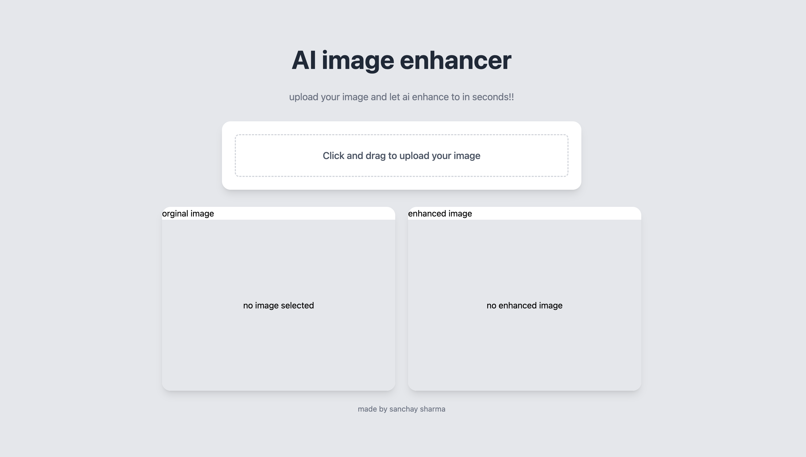
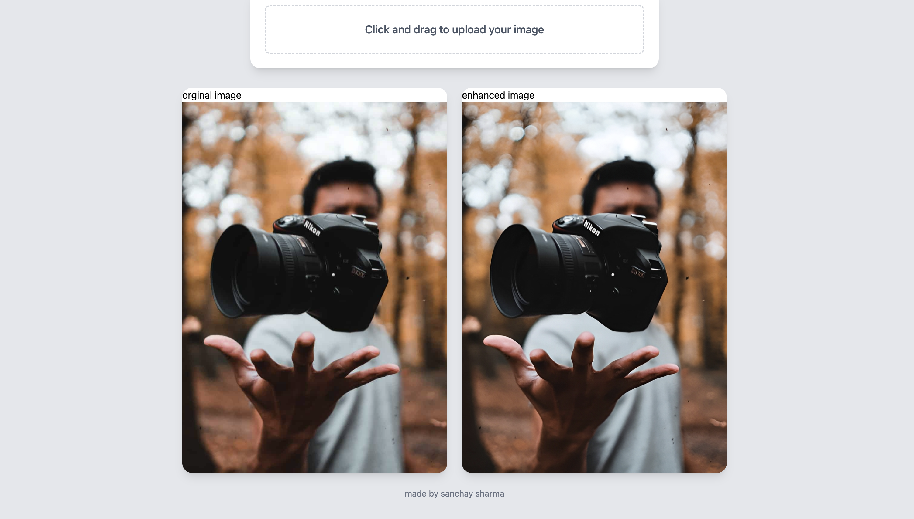

# 🖼️ Image Enhancer Pro

A powerful React + Vite application that enhances image quality using advanced AI technology. Transform your low-resolution images into high-quality masterpieces with just a few clicks! 🚀

## ✨ Features

- 🎯 High-quality image enhancement
- ⚡ Fast processing with AI technology
- 📥 Automatic download of enhanced images
- 🎨 Support for various image formats
- 🔄 Real-time processing status updates
- 💫 Modern and intuitive user interface

## 🛠️ Tech Stack

- React 18
- Vite
- Axios for API calls
- Environment Variables for secure API key management

## 🚀 Getting Started

### Prerequisites

- Node.js (v14 or higher)
- npm or yarn

### Installation

1. Clone the repository:
```bash
git clone https://github.com/SharmaSanchay/image-enhancer.git
cd image-enhancer
```

2. Install dependencies:
```bash
npm install
# or
yarn install
```

3. Create a `.env` file in the root directory and add your API key:
```env
VITE_API_KEY=your_api_key_here
```

4. Start the development server:
```bash
npm run dev
# or
yarn dev
```

## 💡 Usage

1. Open the application in your browser http://localhost:5173/
2. Click the upload button or drag and drop an image
3. Wait for the enhancement process to complete
4. The enhanced image will be automatically downloaded

## 🔒 Environment Variables

Create a `.env` file in the root directory with the following variables:

```env
VITE_API_KEY=your_api_key_here
```

## 📦 Project Structure

```
image-enhancer/
├── src/
│   ├── components/
│   ├── utils/
│   │   └── imageenhancer.js
│   ├── App.jsx
│   └── main.jsx
├── public/
├── .env
├── package.json
└── vite.config.js
```

## 🤝 Contributing

Contributions are welcome! Please feel free to submit a Pull Request.

1. Fork the repository
2. Create your feature branch (`git checkout -b feature/AmazingFeature`)
3. Commit your changes (`git commit -m 'Add some AmazingFeature'`)
4. Push to the branch (`git push origin feature/AmazingFeature`)
5. Open a Pull Request

## 📝 License

This project is licensed under the MIT License - see the [LICENSE](LICENSE) file for details.

## 🙏 Acknowledgments

- Thanks to the AI image enhancement API service
- React and Vite communities for their excellent tools
- All contributors who help improve this project

## 💪 Support

If you encounter any issues or have questions, please open an issue in the GitHub repository.

---

Made with ❤️ by Sanchay Sharma


